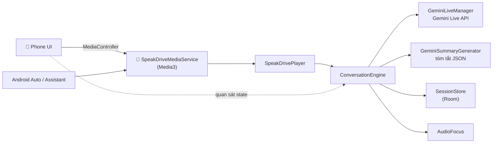

# 🚗 SpeakDrive — Luyện giao tiếp tiếng Anh khi lái xe

App Android giúp luyện nói tiếng Anh **hoàn toàn rảnh tay**, chạy cả trên điện thoại lẫn **Android Auto**.
Gia sư AI dùng **Gemini Live API** để hội thoại bằng giọng nói theo thời gian thực.

> Tiến độ so với kế hoạch: xem [docs/PROGRESS.md](docs/PROGRESS.md) · Kế hoạch gốc: [implementation_plan.md](implementation_plan.md)

## ✨ Tính năng

- 🎤 **Hội thoại giọng nói real-time** với AI: ngắt lời được, có transcript, AI sửa lỗi một cách tự nhiên
- 🚗 **Android Auto**: 4 tab (Bắt đầu, Chủ đề, Nhập vai, Độ khó), điều khiển bằng nút vô-lăng,
  ra lệnh *"Hey Google, play travel English on SpeakDrive"*, nói *"end the lesson"* để kết thúc
- 📚 **8 chủ đề, 32 tình huống nhập vai**, 3 cấp độ (A1 đến C2), cho phép giải thích bằng tiếng Việt khi bí
- 🛡️ **An toàn khi lái xe**: tự tạm dừng khi có cuộc gọi hoặc giọng chỉ đường, tự kết nối lại khi mất sóng
  hoặc khi kết nối Live hết hạn (~10 phút), nhắc nhẹ khi người học im lặng lâu
- 🗣️ **Luyện phát âm "nhắc lại theo AI"**: chấm từng câu bằng AI + so từng từ, thêm **Azure** (tuỳ chọn) chấm
  đến từng âm; sai thì phải nói lại, AI không được khen khi chưa đạt
- 📝 **Tóm tắt sau buổi học**: điểm trôi chảy, ngữ pháp, từ vựng; danh sách lỗi sai; từ mới
- 🔁 **Ôn từ vựng theo lặp lại ngắt quãng** (1, 3, 7, 14, 30, 60 ngày) bằng giọng nói
- 🧠 **AI nhớ bạn qua các buổi**: lỗi hay mắc, từ khó phát âm và những điều bạn kể (công việc, sở thích...)
  được dùng tự nhiên ở buổi sau; xem và xoá từng mục trong "AI đang nhớ gì", tắt được bằng giọng nói
- 🩹 **Ôn lỗi sai**: AI đọc lại câu bạn từng nói sai, bạn sửa rồi đặt câu mới cùng mẫu; lịch ôn ngắt quãng riêng
- 📡 **Luyện offline khi mất sóng**: qua hầm, đường đèo thì điện thoại tự cho luyện nhắc lại câu (TTS và nhận
  dạng giọng nói trên máy), có sóng lại thì gia sư AI tiếp tục
- 🔔 **Nhắc luyện tập hằng ngày** đúng giờ bạn hay luyện (chỉ khi hôm đó chưa luyện) và **bảo toàn chuỗi**
  (7 ngày liên tiếp được 1 lượt, giữ tối đa 2)
- 📊 **Tiến trình**: streak, mục tiêu phút mỗi ngày, biểu đồ 7 ngày, lịch sử từng buổi
- 🔒 Không cần tài khoản, dữ liệu học lưu trên máy, có nút xoá toàn bộ dữ liệu

## 🏗️ Kiến trúc

```
app/    Phone UI (Compose), Room + DataStore, Hilt, App Check, PlaybackConnection
auto/   MediaLibraryService cho Android Auto, SpeakDrivePlayer, cây menu, lệnh giọng nói
ai/     ConversationEngine, GeminiLiveManager (Live API), tóm tắt, prompts, TopicManager
audio/  Micro & loa (tắt micro khi AI nói để chống vọng), audio focus, thông báo bằng giọng nói khi offline
```



Điện thoại và xe dùng **chung một** `ConversationEngine`. Bài học luôn chạy bên trong foreground service
của Media3, nên vẫn tiếp tục khi màn hình tắt.

## 🚀 Cài đặt & chạy

Yêu cầu: Android Studio bản mới nhất (AGP 9), JDK 17, Android SDK 36.

1. **Firebase** (bắt buộc để AI chạy được): làm theo [docs/FIREBASE_SETUP.md](docs/FIREBASE_SETUP.md).
   File `app/google-services.json` trong repo chỉ là file mẫu.
2. Build và cài:

```bash
./gradlew installDebug
```

3. Kiểm thử tự động:

```bash
./gradlew testDebugUnitTest lintDebug
```

4. Thử Android Auto bằng Desktop Head Unit: [docs/TESTING.md](docs/TESTING.md).
5. Phát hành lên Google Play: [docs/RELEASE.md](docs/RELEASE.md).

Có thể đổi model AI trong `gradle.properties` (`speakdrive.liveModel`, `speakdrive.textModel`).

## 📄 Tài liệu

| File | Nội dung |
|---|---|
| [docs/PROGRESS.md](docs/PROGRESS.md) | Tiến độ so với kế hoạch, những việc còn lại |
| [docs/FIREBASE_SETUP.md](docs/FIREBASE_SETUP.md) | Firebase, Gemini, App Check |
| [docs/AZURE_SETUP.md](docs/AZURE_SETUP.md) | Chấm phát âm bằng Azure (tuỳ chọn, miễn phí 5 giờ/tháng) |
| [docs/TESTING.md](docs/TESTING.md) | Test tự động, kịch bản thử trên điện thoại và DHU |
| [docs/RELEASE.md](docs/RELEASE.md) | Ký app, Play Console, Data safety, review Android Auto |
| [docs/PRIVACY_POLICY.md](docs/PRIVACY_POLICY.md) | Chính sách bảo mật (VI/EN) |
| [docs/STORE_LISTING.md](docs/STORE_LISTING.md) | Nội dung trang Play Store (VI/EN) |

## License

MIT
