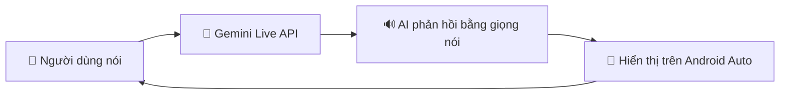
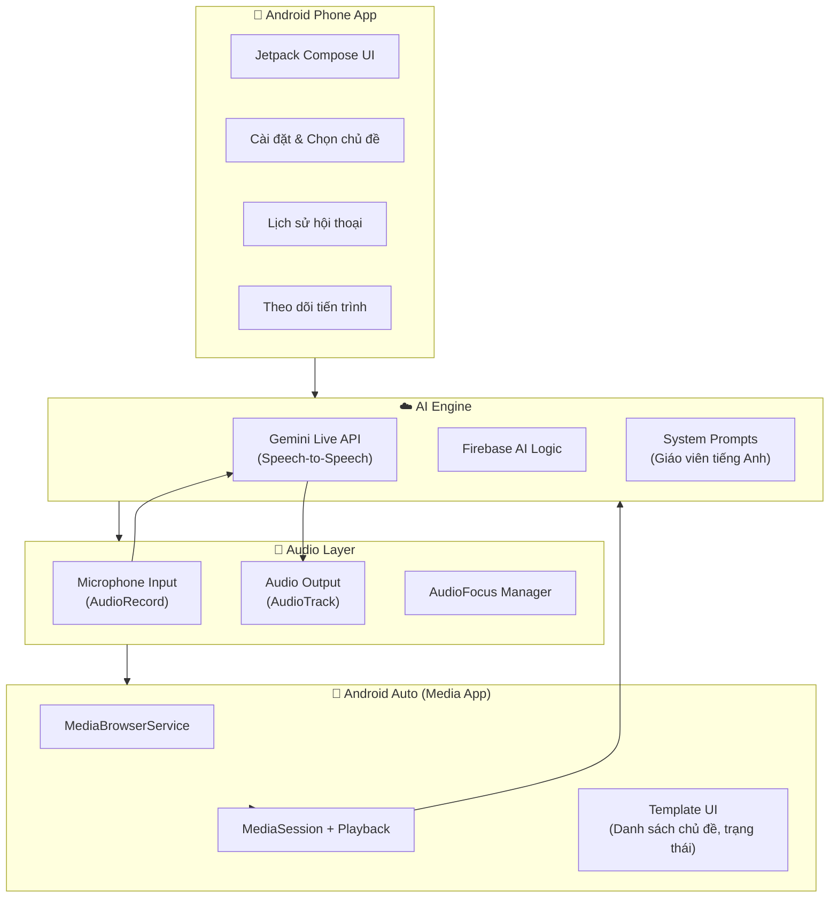
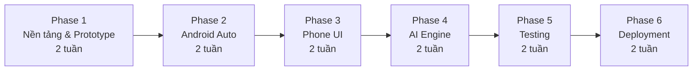

# 🚗 Kế Hoạch Triển Khai: English Speaking App cho Android Auto

## 📋 Tổng Quan Dự Án

**Tên ứng dụng:** SpeakDrive — Luyện Giao Tiếp Tiếng Anh Khi Lái Xe  
**Mục tiêu:** Xây dựng ứng dụng Android hỗ trợ luyện nói tiếng Anh hoàn toàn rảnh tay (100% hands-free), tích hợp Android Auto, sử dụng AI Gemini Live để tạo hội thoại tự nhiên.



> [!IMPORTANT]
> **Ràng buộc quan trọng:** Android Auto chỉ hỗ trợ các loại app: Media, Navigation, Messaging, POI, IoT, Weather. App luyện tiếng Anh sẽ được xây dựng dưới dạng **Media App** — đóng vai trò như một "đài phát thanh AI" tương tác, phù hợp với chính sách Google Play Store.

---

## 🏗️ Kiến Trúc Tổng Thể



---

## 📦 Tech Stack

| Thành phần | Công nghệ | Lý do chọn |
|---|---|---|
| **Ngôn ngữ** | Kotlin | Ngôn ngữ chính cho Android |
| **UI Framework** | Jetpack Compose | UI hiện đại, declarative |
| **Android Auto** | Media3 + Car App Library | API chính thức cho media app trên Auto |
| **AI Engine** | Gemini Live API (via Firebase AI Logic) | Speech-to-speech real-time, barge-in support |
| **Audio** | AudioRecord + AudioTrack | Low-level audio streaming |
| **Backend** | Firebase (Auth, Firestore, Cloud Functions) | Quản lý user, lưu tiến trình |
| **DI** | Hilt | Dependency Injection chuẩn Android |
| **Local Storage** | Room Database | Cache offline, lịch sử hội thoại |
| **Build** | Gradle KTS + Version Catalogs | Build system hiện đại |

---

## 🎯 Tính Năng Chi Tiết

### Tính năng cốt lõi (MVP)

| # | Tính năng | Mô tả | Ưu tiên |
|---|---|---|---|
| F1 | **Hội thoại AI real-time** | Trò chuyện tiếng Anh với AI bằng giọng nói, AI nghe và phản hồi bằng giọng nói tự nhiên | 🔴 P0 |
| F2 | **Chủ đề hội thoại** | Chọn chủ đề trước khi lái (du lịch, công việc, mua sắm, phỏng vấn...) | 🔴 P0 |
| F3 | **Android Auto Media UI** | Hiển thị trạng thái hội thoại, chủ đề đang học trên màn hình xe | 🔴 P0 |
| F4 | **Voice command khởi động** | "Hey Google, play English lesson on SpeakDrive" | 🔴 P0 |
| F5 | **Phản hồi phát âm** | AI nhận xét và sửa lỗi phát âm, ngữ pháp sau mỗi câu | 🟡 P1 |
| F6 | **Điều chỉnh độ khó** | Beginner / Intermediate / Advanced — AI tự điều chỉnh tốc độ và từ vựng | 🟡 P1 |
| F7 | **Tóm tắt sau chuyến đi** | Khi dừng xe: tóm tắt bài học, từ mới, lỗi cần cải thiện | 🟡 P1 |

### Tính năng nâng cao (Post-MVP)

| # | Tính năng | Mô tả | Ưu tiên |
|---|---|---|---|
| F8 | **Roleplay scenarios** | AI đóng vai (nhân viên nhà hàng, bạn đồng hành, sếp...) | 🟢 P2 |
| F9 | **Spaced repetition** | Ôn lại từ vựng/cấu trúc đã học theo thuật toán lặp lại cách quãng | 🟢 P2 |
| F10 | **Tiến trình & thống kê** | Theo dõi thời gian luyện tập, số từ mới, điểm phát âm | 🟢 P2 |
| F11 | **Offline mode** | Cache bài học phổ biến để dùng khi mất sóng (vùng hầm, ngoại ô) | 🟢 P2 |
| F12 | **Multi-language** | Hỗ trợ giao diện tiếng Việt, giải thích bằng tiếng Việt khi cần | 🟢 P2 |

---

## 📁 Cấu Trúc Dự Án

```
SpeakDrive/
├── app/                              # Module chính (Phone app)
│   └── src/main/
│       ├── java/com/speakdrive/
│       │   ├── SpeakDriveApplication.kt
│       │   ├── di/                   # Hilt modules
│       │   │   ├── AppModule.kt
│       │   │   ├── AIModule.kt
│       │   │   └── AudioModule.kt
│       │   ├── ui/                   # Jetpack Compose UI
│       │   │   ├── MainActivity.kt
│       │   │   ├── theme/
│       │   │   ├── screens/
│       │   │   │   ├── HomeScreen.kt
│       │   │   │   ├── TopicSelectionScreen.kt
│       │   │   │   ├── ConversationScreen.kt
│       │   │   │   ├── ProgressScreen.kt
│       │   │   │   └── SettingsScreen.kt
│       │   │   └── components/
│       │   ├── data/                 # Data layer
│       │   │   ├── local/
│       │   │   │   ├── AppDatabase.kt
│       │   │   │   ├── dao/
│       │   │   │   └── entity/
│       │   │   ├── remote/
│       │   │   │   └── FirebaseRepository.kt
│       │   │   └── repository/
│       │   └── domain/               # Business logic
│       │       ├── model/
│       │       ├── usecase/
│       │       └── repository/
│       ├── res/
│       │   └── xml/
│       │       └── automotive_app_desc.xml
│       └── AndroidManifest.xml
│
├── auto/                             # Module Android Auto
│   └── src/main/
│       ├── java/com/speakdrive/auto/
│       │   ├── SpeakDriveMediaService.kt      # MediaBrowserServiceCompat
│       │   ├── SpeakDriveMediaSession.kt      # MediaSession management
│       │   ├── MediaContentProvider.kt        # Cung cấp media tree
│       │   ├── PlaybackManager.kt             # Quản lý playback state
│       │   └── VoiceCommandHandler.kt         # Xử lý onPlayFromSearch
│       └── AndroidManifest.xml
│
├── ai/                               # Module AI Engine
│   └── src/main/
│       ├── java/com/speakdrive/ai/
│       │   ├── GeminiLiveManager.kt           # Gemini Live API wrapper
│       │   ├── ConversationEngine.kt          # Logic hội thoại
│       │   ├── PromptTemplates.kt             # System prompts cho AI
│       │   ├── PronunciationAnalyzer.kt       # Phân tích phát âm
│       │   └── TopicManager.kt                # Quản lý chủ đề
│       └── prompts/
│           ├── system_prompt_beginner.txt
│           ├── system_prompt_intermediate.txt
│           └── system_prompt_advanced.txt
│
├── audio/                            # Module Audio Processing
│   └── src/main/
│       └── java/com/speakdrive/audio/
│           ├── AudioStreamManager.kt          # Streaming audio I/O
│           ├── MicrophoneRecorder.kt          # AudioRecord wrapper
│           ├── AudioPlayer.kt                 # AudioTrack wrapper
│           └── AudioFocusHandler.kt           # Audio focus management
│
├── build.gradle.kts                  # Root build file
├── settings.gradle.kts
└── gradle/
    └── libs.versions.toml            # Version catalog
```

---

## 🚀 Kế Hoạch Triển Khai Từng Phase

### Phase 1: Nền Tảng & Prototype (Tuần 1-2)

> [!NOTE]
> Phase này tập trung vào việc thiết lập project, cấu hình build system, và tạo prototype cơ bản để chứng minh tính khả thi (proof of concept).

#### Bước 1.1: Khởi tạo dự án Android

**Mục tiêu:** Tạo project Android với cấu trúc multi-module

**Chi tiết:**
1. Sử dụng `android create` CLI để tạo project mới với Compose template
2. Cấu hình `settings.gradle.kts` với 4 modules: `app`, `auto`, `ai`, `audio`
3. Thiết lập Version Catalog (`libs.versions.toml`) với tất cả dependencies
4. Cấu hình Hilt cho Dependency Injection
5. Thiết lập Firebase project và kết nối

**Dependencies chính:**
```kotlin
// libs.versions.toml
[versions]
kotlin = "2.1.0"
compose-bom = "2026.10.00"
media3 = "1.6.0"
car-app = "1.9.0"
firebase-bom = "34.19.0"
hilt = "2.53"
room = "2.7.0"

[libraries]
# Android Auto
car-app-library = { group = "androidx.car.app", name = "app", version.ref = "car-app" }
media3-session = { group = "androidx.media3", name = "media3-session", version.ref = "media3" }
media3-exoplayer = { group = "androidx.media3", name = "media3-exoplayer", version.ref = "media3" }

# Firebase AI
firebase-ai = { group = "com.google.firebase", name = "firebase-ai" }

# ... other dependencies
```

**Tiêu chí hoàn thành:**
- [ ] Project build thành công
- [ ] Tất cả modules được kết nối đúng
- [ ] Firebase project đã được tạo và cấu hình

---

#### Bước 1.2: Xây dựng Audio Layer

**Mục tiêu:** Module ghi/phát âm thanh real-time với low latency

**Chi tiết:**

```kotlin
// audio/src/main/java/com/speakdrive/audio/MicrophoneRecorder.kt
class MicrophoneRecorder @Inject constructor() {
    private var audioRecord: AudioRecord? = null
    private val sampleRate = 16000 // 16kHz cho speech recognition
    private val channelConfig = AudioFormat.CHANNEL_IN_MONO
    private val audioFormat = AudioFormat.ENCODING_PCM_16BIT
    
    fun startRecording(): Flow<ByteArray> = callbackFlow {
        val bufferSize = AudioRecord.getMinBufferSize(sampleRate, channelConfig, audioFormat)
        audioRecord = AudioRecord(
            MediaRecorder.AudioSource.VOICE_RECOGNITION,
            sampleRate, channelConfig, audioFormat, bufferSize
        )
        audioRecord?.startRecording()
        
        val buffer = ByteArray(bufferSize)
        while (isActive) {
            val bytesRead = audioRecord?.read(buffer, 0, buffer.size) ?: 0
            if (bytesRead > 0) {
                send(buffer.copyOf(bytesRead))
            }
        }
        
        awaitClose { stopRecording() }
    }
    
    fun stopRecording() {
        audioRecord?.stop()
        audioRecord?.release()
        audioRecord = null
    }
}
```

```kotlin
// audio/src/main/java/com/speakdrive/audio/AudioFocusHandler.kt
class AudioFocusHandler @Inject constructor(
    private val audioManager: AudioManager
) {
    private var focusRequest: AudioFocusRequest? = null
    
    fun requestFocus(onFocusChange: (Int) -> Unit): Boolean {
        focusRequest = AudioFocusRequest.Builder(AudioManager.AUDIOFOCUS_GAIN)
            .setAudioAttributes(
                AudioAttributes.Builder()
                    .setUsage(AudioAttributes.USAGE_MEDIA)
                    .setContentType(AudioAttributes.CONTENT_TYPE_SPEECH)
                    .build()
            )
            .setOnAudioFocusChangeListener(onFocusChange)
            .build()
        
        return audioManager.requestAudioFocus(focusRequest!!) == 
            AudioManager.AUDIOFOCUS_REQUEST_GRANTED
    }
    
    fun abandonFocus() {
        focusRequest?.let { audioManager.abandonAudioFocusRequest(it) }
    }
}
```

**Tiêu chí hoàn thành:**
- [ ] Ghi âm từ microphone thành công (16kHz, mono, PCM 16bit)
- [ ] Phát âm thanh từ stream thành công
- [ ] Audio focus hoạt động đúng (tạm dừng khi có cuộc gọi, navigation...)

---

#### Bước 1.3: Tích hợp Gemini Live API

**Mục tiêu:** Kết nối với Gemini Live API để thực hiện hội thoại speech-to-speech

**Chi tiết:**

```kotlin
// ai/src/main/java/com/speakdrive/ai/GeminiLiveManager.kt
class GeminiLiveManager @Inject constructor() {
    private var liveSession: LiveSession? = null
    
    private val model = Firebase.ai.liveModel(
        modelName = "gemini-3.1-flash-live-preview",
        generationConfig = liveGenerationConfig {
            responseModalities = listOf(ResponseModality.AUDIO)
            speechConfig = speechConfig {
                voiceConfig = voiceConfig {
                    prebuiltVoiceConfig = prebuiltVoiceConfig {
                        voiceName = "Kore" // Giọng nữ tự nhiên
                    }
                }
            }
        },
        systemInstruction = Content { text(PromptTemplates.getSystemPrompt()) }
    )
    
    suspend fun connect() {
        liveSession = model.connect()
    }
    
    /**
     * Stream audio từ microphone → Gemini
     * Nhận audio response từ Gemini → speaker
     */
    suspend fun streamConversation(
        audioInput: Flow<ByteArray>,
        onAudioResponse: (ByteArray) -> Unit,
        onTextResponse: (String) -> Unit
    ) {
        val session = liveSession ?: throw IllegalStateException("Not connected")
        
        // Song song: gửi audio input và nhận response
        coroutineScope {
            // Gửi audio chunks tới Gemini
            launch {
                audioInput.collect { chunk ->
                    session.sendAudioChunk(chunk)
                }
            }
            
            // Nhận response từ Gemini
            launch {
                session.receive().collect { response ->
                    response.audio?.let { audioData ->
                        onAudioResponse(audioData)
                    }
                    response.text?.let { text ->
                        onTextResponse(text)
                    }
                }
            }
        }
    }
    
    suspend fun disconnect() {
        liveSession?.close()
        liveSession = null
    }
}
```

```kotlin
// ai/src/main/java/com/speakdrive/ai/PromptTemplates.kt
object PromptTemplates {
    fun getSystemPrompt(
        level: DifficultyLevel = DifficultyLevel.INTERMEDIATE,
        topic: Topic? = null
    ): String = """
        You are a friendly, patient English conversation partner helping a Vietnamese 
        speaker practice English while they are driving.
        
        CRITICAL RULES:
        - Keep responses SHORT (2-3 sentences max) — the user is driving
        - Speak NATURALLY and conversationally
        - If the user makes a grammar/pronunciation error, gently correct it 
          by repeating the correct version naturally in your response
        - DO NOT ask the user to read or look at anything
        - DO NOT give long explanations — keep it conversational
        - Adjust vocabulary to ${level.description} level
        - If the user seems confused, simplify and rephrase
        - Occasionally introduce a new useful phrase and use it in context
        ${topic?.let { "- Focus the conversation on: ${it.description}" } ?: ""}
        
        CONVERSATION STYLE:
        - Be warm and encouraging
        - Use natural filler words occasionally ("Well...", "You know...")
        - Ask follow-up questions to keep the conversation going
        - If there's a pause, gently prompt with a new question
        
        DIFFICULTY: ${level.name}
        ${when(level) {
            DifficultyLevel.BEGINNER -> """
                - Use simple vocabulary (A1-A2)
                - Speak slowly and clearly
                - Use short, simple sentences
                - Allow mixing Vietnamese and English
            """
            DifficultyLevel.INTERMEDIATE -> """
                - Use everyday vocabulary (B1-B2)
                - Normal speaking pace
                - Introduce common idioms and phrasal verbs
                - Encourage full English responses
            """
            DifficultyLevel.ADVANCED -> """
                - Use sophisticated vocabulary (C1-C2)
                - Natural fast pace
                - Use idioms, slang, and complex structures
                - Challenge the user with nuanced topics
            """
        }}
    """.trimIndent()
}
```

**Tiêu chí hoàn thành:**
- [ ] Kết nối Gemini Live API thành công
- [ ] Nói vào mic → nhận được phản hồi bằng giọng nói từ AI
- [ ] Barge-in hoạt động (ngắt lời AI khi nói)
- [ ] Độ trễ < 2 giây

---

### Phase 2: Android Auto Integration (Tuần 3-4)

> [!NOTE]
> Phase này biến app thành một **Media App** hợp lệ cho Android Auto, cho phép điều khiển hoàn toàn bằng giọng nói và nút trên vô-lăng.

#### Bước 2.1: Xây dựng MediaBrowserService

**Mục tiêu:** Tạo service cung cấp nội dung cho Android Auto dưới dạng media tree

**Thiết kế Media Tree:**
```
Root
├── 📚 Chủ đề hội thoại
│   ├── 🏖️ Du lịch & Đi lại
│   ├── 💼 Công việc & Kinh doanh
│   ├── 🍽️ Ăn uống & Nhà hàng
│   ├── 🛒 Mua sắm
│   ├── 🏥 Y tế & Sức khỏe
│   ├── 🎭 Giải trí & Phim ảnh
│   ├── 💬 Giao tiếp hàng ngày
│   └── 🎯 Phỏng vấn xin việc
├── 🔄 Tiếp tục bài học gần nhất
├── 🎲 Chủ đề ngẫu nhiên
└── ⚙️ Cài đặt
    ├── Beginner
    ├── Intermediate
    └── Advanced
```

**Chi tiết:**

```kotlin
// auto/src/main/java/com/speakdrive/auto/SpeakDriveMediaService.kt
@AndroidEntryPoint
class SpeakDriveMediaService : MediaLibraryService() {
    
    @Inject lateinit var conversationEngine: ConversationEngine
    @Inject lateinit var audioStreamManager: AudioStreamManager
    
    private lateinit var mediaSession: MediaLibrarySession
    private lateinit var player: SpeakDrivePlayer // Custom Player
    
    override fun onCreate() {
        super.onCreate()
        
        player = SpeakDrivePlayer(this, conversationEngine, audioStreamManager)
        
        mediaSession = MediaLibrarySession.Builder(this, player, LibraryCallback())
            .setSessionActivity(createPendingIntent())
            .build()
    }
    
    override fun onGetSession(controllerInfo: MediaSession.ControllerInfo) = mediaSession
    
    private inner class LibraryCallback : MediaLibrarySession.Callback {
        override fun onGetLibraryRoot(
            session: MediaLibrarySession,
            browser: MediaSession.ControllerInfo,
            params: LibraryParams?
        ): ListenableFuture<LibraryResult<MediaItem>> {
            return Futures.immediateFuture(
                LibraryResult.ofItem(MediaContentProvider.getRootItem(), params)
            )
        }
        
        override fun onGetChildren(
            session: MediaLibrarySession,
            browser: MediaSession.ControllerInfo,
            parentId: String,
            page: Int,
            pageSize: Int,
            params: LibraryParams?
        ): ListenableFuture<LibraryResult<ImmutableList<MediaItem>>> {
            val children = MediaContentProvider.getChildren(parentId)
            return Futures.immediateFuture(
                LibraryResult.ofItemList(children, params)
            )
        }
        
        override fun onPlaybackResumption(
            mediaSession: MediaSession,
            controller: MediaSession.ControllerInfo
        ): ListenableFuture<MediaItemsWithStartPosition> {
            // Tiếp tục bài học gần nhất
            return Futures.immediateFuture(
                MediaContentProvider.getLastLesson()
            )
        }
    }
}
```

```kotlin
// auto/src/main/java/com/speakdrive/auto/MediaContentProvider.kt
object MediaContentProvider {
    
    private val topics = listOf(
        Topic("travel", "Du lịch & Đi lại", "Travel & Getting Around", R.drawable.ic_travel),
        Topic("work", "Công việc & Kinh doanh", "Work & Business", R.drawable.ic_work),
        Topic("food", "Ăn uống & Nhà hàng", "Food & Dining", R.drawable.ic_food),
        Topic("shopping", "Mua sắm", "Shopping", R.drawable.ic_shopping),
        Topic("health", "Y tế & Sức khỏe", "Health & Medical", R.drawable.ic_health),
        Topic("entertainment", "Giải trí & Phim ảnh", "Entertainment & Movies", R.drawable.ic_entertainment),
        Topic("daily", "Giao tiếp hàng ngày", "Daily Conversation", R.drawable.ic_daily),
        Topic("interview", "Phỏng vấn xin việc", "Job Interview", R.drawable.ic_interview),
    )
    
    fun getChildren(parentId: String): List<MediaItem> {
        return when (parentId) {
            ROOT_ID -> listOf(
                buildBrowsableItem("topics", "Chủ đề hội thoại", "Chọn chủ đề để luyện tập"),
                buildPlayableItem("resume", "Tiếp tục bài học gần nhất", "Tiếp tục từ lần trước"),
                buildPlayableItem("random", "Chủ đề ngẫu nhiên", "AI chọn chủ đề cho bạn"),
                buildBrowsableItem("settings", "Cài đặt độ khó", "Beginner / Intermediate / Advanced"),
            )
            "topics" -> topics.map { topic ->
                buildPlayableItem(
                    id = "topic_${topic.id}",
                    title = topic.titleVi,
                    subtitle = topic.titleEn,
                    iconRes = topic.iconRes
                )
            }
            "settings" -> DifficultyLevel.entries.map { level ->
                buildPlayableItem(
                    id = "level_${level.name}",
                    title = level.displayName,
                    subtitle = level.description
                )
            }
            else -> emptyList()
        }
    }
}
```

**Tiêu chí hoàn thành:**
- [ ] App xuất hiện trong danh sách media trên Android Auto
- [ ] Media tree hiển thị đúng các chủ đề
- [ ] Chọn chủ đề → bắt đầu bài học hội thoại

---

#### Bước 2.2: Custom Player cho Hội Thoại AI

**Mục tiêu:** Tạo custom Player xử lý "playback" thực chất là phiên hội thoại AI

**Chi tiết:**

```kotlin
// auto/src/main/java/com/speakdrive/auto/SpeakDrivePlayer.kt
class SpeakDrivePlayer(
    private val context: Context,
    private val conversationEngine: ConversationEngine,
    private val audioStreamManager: AudioStreamManager
) : ForwardingSimpleBasePlayer(Looper.getMainLooper()) {
    
    private var currentTopic: Topic? = null
    private var isConversationActive = false
    
    override fun getState(): State {
        return State.Builder()
            .setAvailableCommands(
                Player.Commands.Builder()
                    .addAll(
                        Player.COMMAND_PLAY_PAUSE,
                        Player.COMMAND_STOP,
                        Player.COMMAND_SEEK_TO_NEXT,  // = Chuyển chủ đề
                    )
                    .build()
            )
            .setPlayWhenReady(isConversationActive, PLAY_WHEN_READY_CHANGE_REASON_USER_REQUEST)
            .setPlaybackState(
                if (isConversationActive) Player.STATE_READY 
                else Player.STATE_IDLE
            )
            .setCurrentMediaItemIndex(0)
            .setPlaylist(listOf(
                MediaItemData.Builder("conversation")
                    .setMediaItem(createCurrentMediaItem())
                    .build()
            ))
            .build()
    }
    
    override fun handleSetPlayWhenReady(playWhenReady: Boolean): ListenableFuture<*> {
        if (playWhenReady) {
            startConversation()
        } else {
            pauseConversation()
        }
        return Futures.immediateVoidFuture()
    }
    
    private fun startConversation() {
        isConversationActive = true
        CoroutineScope(Dispatchers.IO).launch {
            conversationEngine.startSession(currentTopic)
            audioStreamManager.startStreaming()
        }
    }
    
    private fun pauseConversation() {
        isConversationActive = false
        CoroutineScope(Dispatchers.IO).launch {
            audioStreamManager.stopStreaming()
            conversationEngine.pauseSession()
        }
    }
}
```

**Tiêu chí hoàn thành:**
- [ ] Play/Pause trên Android Auto → bắt đầu/dừng hội thoại
- [ ] Nút trên vô-lăng hoạt động đúng
- [ ] MediaSession metadata hiển thị chủ đề đang học

---

#### Bước 2.3: Xử lý Voice Commands

**Mục tiêu:** "Hey Google, play English lesson on SpeakDrive" → khởi động bài học

```kotlin
// auto/src/main/java/com/speakdrive/auto/VoiceCommandHandler.kt
class VoiceCommandHandler @Inject constructor(
    private val topicManager: TopicManager,
    private val conversationEngine: ConversationEngine
) {
    /**
     * Xử lý voice search từ Google Assistant
     * Ví dụ: "Play travel lesson on SpeakDrive"
     *        "Play English practice on SpeakDrive"
     */
    fun handlePlayFromSearch(query: String?, extras: Bundle?): MediaItem? {
        if (query.isNullOrEmpty()) {
            // Trả về bài học gần nhất hoặc chủ đề ngẫu nhiên
            return topicManager.getResumeOrRandom()
        }
        
        // Phân tích query để tìm chủ đề phù hợp
        val matchedTopic = topicManager.findTopicByQuery(query)
        
        // Phân tích độ khó nếu có mention
        val level = when {
            query.contains("easy", ignoreCase = true) || 
            query.contains("beginner", ignoreCase = true) -> DifficultyLevel.BEGINNER
            query.contains("hard", ignoreCase = true) || 
            query.contains("advanced", ignoreCase = true) -> DifficultyLevel.ADVANCED
            else -> null // Giữ nguyên setting hiện tại
        }
        
        return matchedTopic?.toMediaItem(level)
    }
}
```

**AndroidManifest.xml cho Android Auto:**
```xml
<!-- auto/src/main/AndroidManifest.xml -->
<manifest xmlns:android="http://schemas.android.com/apk/res/android">
    
    <uses-permission android:name="android.permission.RECORD_AUDIO" />
    <uses-permission android:name="android.permission.INTERNET" />
    <uses-permission android:name="android.permission.FOREGROUND_SERVICE" />
    <uses-permission android:name="android.permission.FOREGROUND_SERVICE_MEDIA_PLAYBACK" />
    
    <application>
        <service
            android:name=".SpeakDriveMediaService"
            android:exported="true"
            android:foregroundServiceType="mediaPlayback">
            <intent-filter>
                <action android:name="androidx.media3.session.MediaLibraryService" />
                <action android:name="android.media.browse.MediaBrowserService" />
            </intent-filter>
        </service>
        
        <meta-data
            android:name="com.google.android.gms.car.application"
            android:resource="@xml/automotive_app_desc" />
    </application>
</manifest>
```

```xml
<!-- auto/src/main/res/xml/automotive_app_desc.xml -->
<automotiveApp>
    <uses name="media" />
</automotiveApp>
```

**Tiêu chí hoàn thành:**
- [ ] "Hey Google, play on SpeakDrive" → bắt đầu bài học
- [ ] "Hey Google, play travel English on SpeakDrive" → bài học về du lịch
- [ ] Nút play/pause trên vô-lăng hoạt động

---

### Phase 3: Phone App UI (Tuần 5-6)

> [!NOTE]
> Giao diện trên điện thoại dùng để chuẩn bị bài học, xem lịch sử, và theo dõi tiến trình. Tất cả tương tác trong khi lái xe đều qua Android Auto.

#### Bước 3.1: Home Screen & Topic Selection

**Mục tiêu:** Màn hình chính cho phép chọn chủ đề, xem tiến trình nhanh

```kotlin
// app/src/main/java/com/speakdrive/ui/screens/HomeScreen.kt
@Composable
fun HomeScreen(
    viewModel: HomeViewModel = hiltViewModel(),
    onTopicSelected: (Topic) -> Unit,
    onSettingsClick: () -> Unit
) {
    val uiState by viewModel.uiState.collectAsStateWithLifecycle()
    
    Scaffold(
        topBar = { 
            TopAppBar(
                title = { Text("SpeakDrive") },
                actions = { 
                    IconButton(onClick = onSettingsClick) { 
                        Icon(Icons.Default.Settings, "Settings") 
                    }
                }
            )
        }
    ) { padding ->
        LazyColumn(modifier = Modifier.padding(padding)) {
            // Banner: Kết nối Android Auto
            item {
                AndroidAutoConnectionBanner(isConnected = uiState.isAutoConnected)
            }
            
            // Quick Start
            item {
                QuickStartCard(
                    lastTopic = uiState.lastTopic,
                    onResume = { onTopicSelected(uiState.lastTopic) },
                    onRandom = { onTopicSelected(Topic.RANDOM) }
                )
            }
            
            // Streak & Stats
            item {
                StatsRow(
                    streak = uiState.streakDays,
                    totalMinutes = uiState.totalMinutesToday,
                    wordsLearned = uiState.wordsLearnedToday
                )
            }
            
            // Danh sách chủ đề
            item { 
                Text("Chủ đề luyện tập", style = MaterialTheme.typography.titleLarge) 
            }
            items(uiState.topics) { topic ->
                TopicCard(
                    topic = topic,
                    progress = uiState.topicProgress[topic.id] ?: 0f,
                    onClick = { onTopicSelected(topic) }
                )
            }
        }
    }
}
```

#### Bước 3.2: Conversation Screen (trên điện thoại)

**Mục tiêu:** Khi không kết nối Android Auto, người dùng có thể luyện tập trực tiếp trên điện thoại

```kotlin
// app/src/main/java/com/speakdrive/ui/screens/ConversationScreen.kt
@Composable
fun ConversationScreen(
    topic: Topic,
    viewModel: ConversationViewModel = hiltViewModel()
) {
    val uiState by viewModel.uiState.collectAsStateWithLifecycle()
    
    Column(modifier = Modifier.fillMaxSize()) {
        // Header: Chủ đề + thời gian
        ConversationHeader(topic = topic, duration = uiState.duration)
        
        // Transcript: Hiển thị hội thoại dạng chat
        LazyColumn(
            modifier = Modifier.weight(1f),
            reverseLayout = true
        ) {
            items(uiState.messages) { message ->
                ChatBubble(
                    message = message,
                    isUser = message.role == Role.USER,
                    correction = message.correction // Hiển thị sửa lỗi nếu có
                )
            }
        }
        
        // Voice Control: Nút mic lớn
        VoiceMicButton(
            isListening = uiState.isListening,
            isAISpeaking = uiState.isAISpeaking,
            onToggle = { viewModel.toggleListening() }
        )
    }
}
```

#### Bước 3.3: Trip Summary Screen

**Mục tiêu:** Sau khi kết thúc bài học, hiển thị tóm tắt

```kotlin
// app/src/main/java/com/speakdrive/ui/screens/TripSummaryScreen.kt
@Composable
fun TripSummaryScreen(sessionId: String, viewModel: SummaryViewModel = hiltViewModel()) {
    val summary by viewModel.summary.collectAsStateWithLifecycle()
    
    LazyColumn {
        item { 
            // Thời gian luyện tập
            DurationCard(duration = summary.duration, topic = summary.topic)
        }
        item {
            // Điểm tổng thể
            ScoreCard(
                fluency = summary.fluencyScore,
                grammar = summary.grammarScore,
                vocabulary = summary.vocabularyScore
            )
        }
        item {
            // Từ mới đã học
            NewWordsSection(words = summary.newWords)
        }
        item {
            // Lỗi phổ biến cần cải thiện
            ImprovementSection(corrections = summary.corrections)
        }
        item {
            // Gợi ý bài học tiếp theo
            NextLessonSuggestion(suggestion = summary.nextSuggestion)
        }
    }
}
```

**Tiêu chí hoàn thành:**
- [ ] Home Screen hiển thị đầy đủ chủ đề và tiến trình
- [ ] Luyện tập trên điện thoại hoạt động (fallback khi không có Auto)
- [ ] Trip Summary hiển thị đúng sau mỗi phiên

---

### Phase 4: Conversation Engine Nâng Cao (Tuần 7-8)

#### Bước 4.1: Logic Hội Thoại Thông Minh

**Mục tiêu:** AI không chỉ trò chuyện mà còn dạy một cách có hệ thống

```kotlin
// ai/src/main/java/com/speakdrive/ai/ConversationEngine.kt
class ConversationEngine @Inject constructor(
    private val geminiLiveManager: GeminiLiveManager,
    private val topicManager: TopicManager,
    private val progressTracker: ProgressTracker,
    private val sessionRepository: SessionRepository
) {
    private var currentSession: ConversationSession? = null
    
    suspend fun startSession(topic: Topic?, level: DifficultyLevel? = null) {
        val resolvedTopic = topic ?: topicManager.suggestTopic()
        val resolvedLevel = level ?: progressTracker.getCurrentLevel()
        
        // Cập nhật system prompt cho session mới
        val prompt = PromptTemplates.getSystemPrompt(
            level = resolvedLevel,
            topic = resolvedTopic
        )
        
        geminiLiveManager.updateSystemInstruction(prompt)
        geminiLiveManager.connect()
        
        currentSession = ConversationSession(
            topic = resolvedTopic,
            level = resolvedLevel,
            startTime = System.currentTimeMillis()
        )
        
        // AI bắt đầu cuộc hội thoại
        geminiLiveManager.sendText(
            "Start the conversation. Greet the user warmly and begin with " +
            "the topic: ${resolvedTopic.titleEn}. Remember, they are driving."
        )
    }
    
    suspend fun endSession(): SessionSummary {
        val session = currentSession ?: throw IllegalStateException("No active session")
        
        // Yêu cầu AI tổng kết
        val summary = geminiLiveManager.sendTextAndGetResponse("""
            The lesson is ending. Please provide a brief summary in JSON format:
            {
                "fluency_score": 1-10,
                "grammar_score": 1-10,
                "vocabulary_score": 1-10,
                "new_words": ["word1", "word2"],
                "corrections": [
                    {"original": "user said", "corrected": "should say", "explanation": "why"}
                ],
                "encouragement": "A short encouraging message"
            }
        """)
        
        geminiLiveManager.disconnect()
        
        // Lưu session vào database
        sessionRepository.saveSession(session, summary)
        
        return summary
    }
}
```

#### Bước 4.2: Xử Lý Context Lái Xe

**Mục tiêu:** AI nhận biết ngữ cảnh lái xe và phản ứng phù hợp

```kotlin
// ai/src/main/java/com/speakdrive/ai/DrivingContextManager.kt
class DrivingContextManager @Inject constructor() {
    
    /**
     * Khi phát hiện im lặng lâu → AI nhắc nhẹ
     * Khi phát hiện tiếng ồn → AI nói to/chậm hơn
     * Khi phát hiện navigation → tạm dừng
     */
    fun getContextualInstruction(): String {
        return buildString {
            appendLine("DRIVING CONTEXT AWARENESS:")
            appendLine("- If user is silent for >15 seconds, gently prompt them")
            appendLine("- Keep turns SHORT — the user needs to focus on driving")
            appendLine("- If user says 'wait', 'hold on', or similar → pause and wait")
            appendLine("- If user says 'stop', 'end lesson' → wrap up the lesson")
            appendLine("- NEVER say 'look at' or 'read this' — they cannot look at a screen")
        }
    }
}
```

**Tiêu chí hoàn thành:**
- [ ] AI bắt đầu hội thoại tự nhiên theo chủ đề
- [ ] AI phản hồi phù hợp khi user im lặng / nói "wait" / nói "stop"
- [ ] Session summary được tạo và lưu đúng

---

### Phase 5: Testing & Polish (Tuần 9-10)

#### Bước 5.1: Thiết lập Testing

**Chi tiết:**

```kotlin
// Unit Tests
class ConversationEngineTest {
    @Test
    fun `startSession with topic sets correct system prompt`()
    
    @Test
    fun `endSession generates valid summary`()
    
    @Test
    fun `handleVoiceCommand routes correctly`()
}

// Integration Tests
class GeminiLiveIntegrationTest {
    @Test
    fun `full conversation flow connects and responds`()
    
    @Test
    fun `barge-in interrupts AI response`()
    
    @Test
    fun `network disconnection handled gracefully`()
}

// Android Auto Tests (DHU)
class AndroidAutoMediaTest {
    @Test
    fun `media tree shows all topics`()
    
    @Test
    fun `play from search returns correct topic`()
    
    @Test
    fun `playback controls map to conversation controls`()
}
```

#### Bước 5.2: Thiết lập Desktop Head Unit (DHU) để test

**Quy trình test:**
1. Cài đặt DHU từ SDK Manager → SDK Tools → Android Auto Desktop Head Unit
2. Kết nối điện thoại qua USB, bật USB debugging
3. Chạy `adb forward tcp:5277 tcp:5277`
4. Chạy `desktop-head-unit.exe`
5. Test các flow: chọn chủ đề → bắt đầu hội thoại → pause → resume → kết thúc

#### Bước 5.3: Edge Cases & Error Handling

| Tình huống | Xử lý |
|---|---|
| Mất kết nối internet | Thông báo bằng giọng nói "Mất kết nối, bài học sẽ tiếp tục khi có mạng" |
| Audio focus bị mất (cuộc gọi đến) | Tạm dừng hội thoại, tự động resume sau cuộc gọi |
| Navigation voice | Hạ volume AI, dừng ghi âm tạm thời |
| Gemini API timeout | Retry tự động, thông báo nếu thất bại liên tục |
| Bluetooth ngắt kết nối | Chuyển sang speaker phone, thông báo user |
| App bị kill trong background | Lưu state, resume khi mở lại |

---

### Phase 6: Deployment (Tuần 11-12)

#### Bước 6.1: Chuẩn Bị Google Play Store

**Checklist:**
- [ ] App icon & feature graphic
- [ ] Screenshots (Phone + Android Auto)
- [ ] Privacy policy (thu thập audio, dữ liệu hội thoại)
- [ ] App description (tiếng Việt & tiếng Anh)
- [ ] Content rating questionnaire
- [ ] Android Auto quality checklist compliance

#### Bước 6.2: App Review cho Android Auto

> [!WARNING]
> Android Auto apps phải qua quy trình review đặc biệt. App phải đáp ứng [Car App Quality Guidelines](https://developer.android.com/cars/design/quality). Quá trình review có thể mất 1-2 tuần.

**Yêu cầu chính:**
1. **Distraction Optimized:** UI tuân thủ template, không có nội dung phức tạp
2. **Voice-First:** Tất cả tính năng chính hoạt động bằng giọng nói
3. **5-Step Limit:** Task flow không quá 5 bước
4. **Crash-Free:** App không crash trên Android Auto
5. **Audio Focus:** Xử lý đúng khi có navigation/cuộc gọi

#### Bước 6.3: Firebase & Backend Setup

```
Firebase Project Structure:
├── Authentication (Google Sign-In)
├── Firestore
│   ├── users/{userId}
│   │   ├── profile
│   │   ├── settings (level, preferred topics)
│   │   └── stats (streak, total time)
│   └── sessions/{sessionId}
│       ├── metadata (topic, duration, scores)
│       ├── transcript[]
│       └── corrections[]
├── Cloud Functions
│   └── generateSessionSummary (post-processing)
└── App Check (bảo vệ API)
```

---

## 📊 Timeline Tổng Kết



| Phase | Thời gian | Output chính |
|---|---|---|
| **Phase 1** | Tuần 1-2 | Prototype: nói vào mic → AI phản hồi bằng giọng |
| **Phase 2** | Tuần 3-4 | App hoạt động trên Android Auto |
| **Phase 3** | Tuần 5-6 | Phone app với UI đầy đủ |
| **Phase 4** | Tuần 7-8 | AI engine thông minh, sửa lỗi phát âm |
| **Phase 5** | Tuần 9-10 | Test trên DHU, fix bugs, edge cases |
| **Phase 6** | Tuần 11-12 | Deploy lên Google Play Store |

---

## ⚠️ Rủi Ro & Giải Pháp

| Rủi ro | Mức độ | Giải pháp |
|---|---|---|
| Google từ chối app trên Android Auto | 🔴 Cao | Tuân thủ 100% Car Quality Guidelines, sử dụng media category |
| Gemini Live API latency cao khi di chuyển | 🟡 Trung bình | Sử dụng model flash (nhẹ, nhanh), cache system prompts |
| Chi phí API Gemini cao | 🟡 Trung bình | Giới hạn thời gian session miễn phí, gói premium |
| Audio quality kém trong xe ồn | 🟡 Trung bình | Sử dụng noise cancellation, VOICE_RECOGNITION audio source |
| Mất sóng trong hầm/ngoại ô | 🟢 Thấp | Post-MVP: offline mode với bài học pre-cached |

---

## 💰 Mô Hình Kinh Doanh (Gợi ý)

| Gói | Giá | Tính năng |
|---|---|---|
| **Free** | \$0 | 10 phút/ngày, 3 chủ đề cơ bản |
| **Plus** | ~\$4.99/tháng | Không giới hạn thời gian, tất cả chủ đề |
| **Pro** | ~\$9.99/tháng | + Phân tích phát âm chi tiết, roleplay, progress tracking |

---

## 🎬 Bước Tiếp Theo

Sau khi duyệt kế hoạch này, tôi sẽ bắt đầu triển khai theo thứ tự:

1. **Khởi tạo project** với `android create` CLI
2. **Thiết lập Firebase** project
3. **Xây dựng Audio Module** (ghi/phát real-time)
4. **Tích hợp Gemini Live API** → đạt prototype đầu tiên

> [!TIP]
> Bạn có thể sử dụng lệnh `/goal` để tôi triển khai toàn bộ Phase 1 một cách tự động và kỹ lưỡng.
